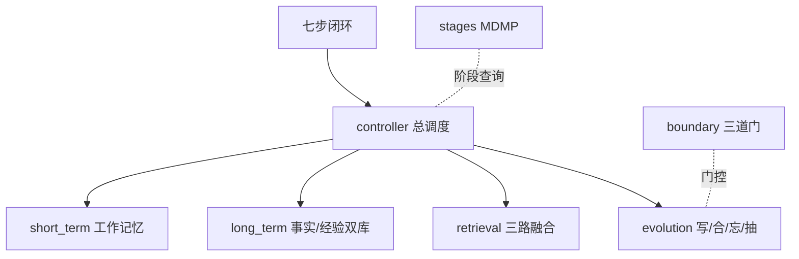

# 面向作战规划智能体的可进化外部记忆系统：设计与实验报告

> 版本：v0.8（DeepSeek 已接入、P0 智戎适配已落地后整理）
> 本文档把“为什么做、怎么做、做成什么样、怎么证明、还差什么”按一条线讲清楚。代码在
> `code/课题3_长短期记忆/`，关键脚本集中在 `eval/`、`examples/`、`integration/zhirong_kit/`。

---

## 摘要

这套系统给作战规划智能体加了一个外部记忆：短期工作记忆管当前场次的上下文组织，长期记忆分事实库与经验库，两层之间只留复盘晋升一条通道。我们先用 50 条作战场景测试集做分层消融，再用 DeepSeek 真实模型做验证。结果分两层看：结构层面——双库在固定用例集上的贡献显著（配对置换检验 p=0.0001），第一场复盘写入的教训在第二场相关任务中召回率 0.83（对照组 0），负例滤噪 0%，遗忘无误删；效果层面——真实模型在生成规划时对装载记忆的宽松引用率 1.00，说明它确实在“用”记忆而不是拿到一堆文本不加理会。局限同样要写在前面：测试集规模撑不起强统计结论，语义泛化与混合检索增益要等真向量模型重跑才能下判断。

---

## 1. 引言：问题与思路

### 1.1 场景

作战规划是场次制：智能体一次接一个任务，产出方案，推演，结束，进入下一场。场次之间没有天然状态传递，模型本身也不保留历史。同一个夜间进攻任务，第一场在隘口吃过亏，第二场通常会再吃一次——因为没有东西提醒它“上次这里栽过”。

### 1.2 四个具体失败模式

我们把问题拆成四类，后面每个设计决策都对应其中一类：

| 编号 | 失败模式 | 后果 |
|---|---|---|
| P1 | 每场从零开始，经验不积累 | 同样的错误反复出现 |
| P2 | 场内战报太多，截断时连硬约束一起丢 | 规划违反约束 |
| P3 | 参数查询和语义查询混在一条路里 | 参数错值或教训召不回 |
| P4 | 复盘内容无差别入库 | 库越攒越脏，且无法审计 |

后期又加了一个由老师反馈引出、但不属于“失败模式”的问题：直接用任务目标文本做检索意义有限。这就是 P5，后面在阶段感知里处理。

### 1.3 思路：把“记忆”当作可进化的外部系统

RAG 只解决“检索外部知识”，不解决“跨场次经验积累”。长上下文只解决“当前提示词放得下”，不解决“旧场次怎么影响新场次”。所以我们把记忆做成一个单独的系统：有写入、有合并、有遗忘、有抽象，每一笔操作都能回放。记忆不是静态库，是随场次变化的东西。

---

## 2. 系统设计

### 2.1 总体结构

```
┌──────────────────────────────────────────────┐
│ 编排：pipeline / controller / zhirong_kit      │
├──────────────────────────────────────────────┤
│ 跨切面：boundary（三道门）· stages（MDMP 阶段）  │
├──────────────────────────────────────────────┤
│ 能力层                                      │
│   short_term   工作记忆（槽位+FIFO+压缩）        │
│   long_term    事实库(SQLite) + 经验库(向量)    │
│   retrieval    vector + bm25 + sql 三路融合     │
│   evolution    写/合/忘/抽 + 复盘驱动           │
├──────────────────────────────────────────────┤
│ 模型层：schema（统一数据模型+遗忘模型+溯源）      │
│ 外部抽象：llm / embeddings（Mock ↔ DeepSeek）   │
└──────────────────────────────────────────────┘
```

四个能力层互相不 import，只通过 schema 里的对象传递数据。这样每一层都能单独做实验，不会因为改了检索就把进化带走。

### 2.2 七步闭环

一次任务在记忆系统里走过七步：

```
① 建槽位（目标/约束）→ ② 查询列表 → ③ 检索 → ④ 装载
→ ⑤ 注入 LLM 上下文 → ⑥ 反馈（AFSIM）→ ⑦ 复盘进化
```

第七步会把本场复盘写入长期库，下一场再走第三步时，新经验就可能被检索到。

### 2.3 双库分治

事实库用 SQLite 存装备参数、条令、地形，查询走属性精确过滤；经验库用向量存教训、对策，查询走语义召回。分家是因为两种查询需求互相拆台：参数错一个数就是事故，教训换个说法也要能搜到。

```
# 事实查询：要精确
SELECT * FROM facts WHERE content LIKE '%T-90%' AND attrs->速度 = '60km/h'
# 经验查询：要相关，不要求字面命中
top_k = vector_index.search("夜战侦察教训")
```

### 2.4 三路检索：融合与单路

检索层把 vector、bm25、sql 三条路放在一起。默认 hybrid 模式三路并行、按权重相加；还留了一个 single 模式，只走指定路，专门给消融做对照。伪代码：

```python
def retrieve(q, mode="hybrid"):
    pool = route(q, q.route)                      # 主路
    if mode == "hybrid":
        for alt in ("vector", "bm25", "sql"):     # 其余两路补充
            pool += route(q, alt)                 # 多路确认
    for r in pool:
        r.score = normalize(r)                    # 各路统一到 [0,1]
    fused = aggregate_by_id(pool, weights)        # 按记忆 id 加权累加
    if q.stage:                                   # 阶段亲和
        fused += stage_bonus for 对口记忆
    ranked = [x for x in sorted(fused) if x.score >= min_score]
    for r in ranked[:top_k]:
        r.entry.mark_recalled()                   # 命中强化只在最终结果做一次
    return ranked[:top_k]
```

两个实现细节值得说明：
- BM25 的归一化用“查询对自身的得分”做上界，而不是池内最大值。否则负例只匹配一个汉字也会被放大到 1.0，噪声会漏进来。这个坑是我们在负例返回率 58% 时发现的。
- 属性精确命中（attrs）绕过 min_score。查询方明确点名了条件，命中就是相关，不该被相似度阈值拦掉。

### 2.5 记忆进化：写、合、忘、抽

```python
def evolve_from_review(review):
    ops = llm.extract_memory_ops(review)      # 建议侧：LLM/规则提候选
    for op in ops:
        if not boundary.promote(op):          # 门控：复盘驱动+类别判定
            continue
        write(op)                             # 写入前 θ 余弦查重
    merge_new_entries()                       # 相似新条目合并
    forget()                                  # 艾宾浩斯淘汰低价值
    if len(new_experiences) >= 2:
        abstract()                            # 抽象成通用教训
```

遗忘公式是 `R = e^(-t/S)`：t 是距上次召回的天数，S 是强度，每次被召回 S 加一。调试中发现一个交互缺陷：抽取规则把含“教训”的句子自动判成 importance=2.0，而 2.0 恰好是保护线阈值，结果所有教训都永远删不掉。修复后自动抽取只给 1.5，保护线留给人工标注和抽象产物。

### 2.6 为什么这么设计

双库、边界、阶段感知、建议-执行分离，四件事各自的理由在下面几行说清楚：

- 双库来自“参数要精确、经验要语义”这个矛盾；
- 边界门控是为了不让场次流水账变成“知识”；
- 阶段感知是老师反馈的落地：任务一句话信息量太薄，按 MDMP 阶段生成查询更贴近规划过程；
- 建议-执行分离是为了可审计——复盘必须能回答“这条为什么被删、从哪来”，全交给黑盒做不到。

---

## 3. 实验设计

### 3.1 数据集：50 条 8 类

| 类 | 数量 | 测什么 |
|---|---|---|
| A 属性精确 | 6 | sql+attrs 参数级召回 |
| B 事实语义 | 6 | vector 转述查询 |
| C 经验转述 | 8 | 同义不同词（刻意错开措辞） |
| D 经验词法 | 4 | bm25 |
| E 负例 | 12 | 噪声返回率 |
| F 参数干扰 | 4 | T-90 vs M1A2 同库，查一个不能排错 |
| G 阶段决胜 | 4 | 同内容不同阶段标签 |
| H 跨场次 | 6 | 第一场复盘→第二场召回 |

构造时的主要考虑是防循环论证：查询和答案不共享关键词（比如 C 类“黑夜机动吃了什么亏”对应“夜间行军未派先遣侦察遭伏击”），并显式放负例和干扰项。缺点是规模太小，跨场次只有 6 条、阶段决胜只有 4 对，统计功效有限——这个限制后面反复出现。

### 3.2 对照组怎么开

关键原则：**用例集固定，靠依赖注入开关能力**。比如关掉经验库，是往控制器注入一个空经验库，而不是删掉经验类用例。跨场次实验的 gold 在运行期解析，因为条目 id 只有进化发生之后才知道。

```python
G2 = MemoryController(experiential=ExperientialStore(empty))   # 关经验库
G3 = MemoryController(experiential=ExperientialStore(full))    # 开经验库
# 两组跑同一条 44 用例，逐用例配对做置换检验
```

### 3.3 指标与统计

检索侧：hit@3、hit@5、MRR、NDCG。任务层另加三个：约束满足率、记忆引用率、噪声污染率。

统计做三件事：
- 随机基线用解析式 `1 - C(n-g,k)/C(n,k)`；
- 置信区间用 bootstrap；
- 两两对比用配对置换检验（同一用例、两组配置，逐条比较，不依赖正态假设）。

### 3.4 系统配置

离线实验全部用 MockEmbedding（字符词袋）与 MockLLM（规则抽取），保证确定性和零依赖。真实模型验证用 DeepSeek `deepseek-flash`，通过统一接口注入，业务代码不动。注意：真实模型验证阶段的检索仍然用 MockEmbedding，所以检索分数是词袋口径；真向量下的重跑还没做（GLM embedding 的 key 已失效，DeepSeek 又不提供 embedding）。

---

## 4. 结果

### 4.1 双库贡献

44 条固定检索用例上：

| 组 | 配置 | hit@5 | 分类别 C/D/G |
|---|---|---|---|
| G2 | 仅事实库 | 0.341 | 0 / 0 / 0 |
| G3 | 双库全开 | **0.636** | 0.63 / 1.0 / 1.0 |

差 0.295，配对置换 p=0.0001。经验类用例在 G2 下全 0 是设计语义：库里没有经验，查不到。随机基线（单 gold，n=14）是 0.357，G3 明显高于它。

这里有一个值得说的对照：旧测试集只有 6 条记忆时，随机 hit@5 就有 0.83，当时报“全 1.0”其实没有意义。这轮把随机基线显式列出来后，0.636 才算是真的“高于瞎猜”。

### 4.2 跨场次复用

| 配置 | H 类 hit@5 |
|---|---|
| 处理组（跑第一场复盘→第二场查） | 0.833 |
| 对照组（不跑第一场，gold 不可达） | 0 |

负控用例（第一场写渡河教训，第二场查巷战）返回 0，说明没有“什么都召回”的假阳性。p=0.059，样本只有 5 条，只能算方向性证据。

### 4.3 检索策略：一个诚实的负结果

| 配置 | hit@5 | 干扰压制 |
|---|---|---|
| hybrid | 0.857 | **1.0** |
| vector 单路 | **0.929** | 0.875 |
| bm25 单路 | 0.786 | 0.875 |
| sql 单路 | 0.214（仅 attrs 用例） | 0.375 |

Mock 词袋下混合没有赢过 vector 单路（p=0.626），但干扰压制更好（1.0 vs 0.875）。我的解释是：词袋里没有可互补的语义信号，混合只能靠多路确认把正确项往前顶。这个负结果没有推翻系统，它划清了 Mock 环境的边界——多路互补有没有价值，必须等真向量重跑再答。

### 4.4 滤噪与遗忘

min_score 扫描：0.05→负例返回率 92%，0.10→58%，0.16→0%，0.25→0%，正例 hit@5 从 0.96 降到 0.82。0.16 是这条曲线的拐点，也是我们采用的默认值。

遗忘研究：30 天未召回·未保护删 10/10，保护删 0，新写入删 0；删完后检索命中分别是被删 0、保护 5、新写 5。误删为零，保护线按设计工作。

### 4.5 真实模型

DeepSeek `deepseek-flash` 验证 20 项全过。最有说服力的是规划生成：模型输出里出现“东侧为唯一装甲通行方向”“夜间行军必须提前派先遣侦察，防止遭伏击”，分别对应装载进上下文的地形事实和历史教训。宽松口径引用率 1.00，约束满足率 1.00；T3 抽象生成 63 字通用教训，没有指令残留。

要坦白：这是 MockEmbedding 检索之上的结果，且只跑了一次。它能说明“LLM 确实引用了装载记忆”，不能说明“真向量下检索更好”。

---

## 5. 讨论

### 5.1 哪些结论站得住

结构层面的结论是稳的：经验库对经验查询有独立贡献、跨场次写入能被后续查询召回、遗忘不误删、滤噪在标定阈值下有效。这些不依赖语义模型质量。

### 5.2 哪些还不行

效果层面有三项没有最终答案：转述类查询的召回、混合检索相对单路的增益、任务层引用率在真实词向量下的表现。当前 T6 只是方向性证据，因为它跑在词袋检索之上且只有一次运行。

测试集也有可指摘的地方：跨场次 6 条、阶段决胜 4 对，p 值只能当参考；测试集是项目组自己标的，虽然刻意错开措辞，同一个作者写两端，循环论证的风险没有完全消除。

### 5.3 已知缺陷

- 知识锚定（入库前与权威知识库比对）没实现，这是文档承诺过但代码里没有的；
- 经验冲突没有仲裁，两条矛盾的教训会共存，谁分高谁被召回；
- 遗忘是硬删除，只有墓碑日志，没有软删除恢复。

这些我不打算在报告里回避，它们就是下一阶段的工作。

---

## 6. 结论

把记忆组织成可进化的外部结构，消融证明分层确实产生了可测差异，真实模型也表现出对装载记忆的实际使用。下一步顺序固定：恢复可用的向量服务 → 把消融在真向量下重跑 → 把跨场次测试集扩到 20 条让 p 值有意义 → 接入智戎真实链路。做完这几步，“待验证”才有机会变成“已验证”。

---

## 7. 如何配图（汇报/报告用图建议）

> 说明：以下图表可按需生成。`eval/results/ablation_report.json` 里已经存了全部消融数字，可以直接喂给脚本画；没有 matplotlib 的环境把脚本里的绘图部分改成任意制图工具即可。

### 图 1：系统架构图（第 2 节）
- **内容**：两层四模块 + 七步闭环，标注“检索只读、进化只写”。
- **做法**：draw.io / 语雀 / PPT 手画即可；也可用 Mermaid：

- **放的位置**：第 2.1 或摘要后。

### 图 2：一场任务的数据流时序图（第 2.2 节）
- Mermaid sequenceDiagram：pipeline → controller → retriever → long_term → evolution，标出“⑦ 写入→下一场 ③ 检索到”的反馈箭头。

### 图 3：测试集结构（第 3.1 节）
- **内容**：8 类条形或色块，标注数量（A6 B6 C8 D4 E12 F4 G4 H6）。
- **做法**：直接表格转柱状图即可。

### 图 4：双库贡献（第 4.1 节）——**建议必配**
- **内容**：G2 vs G3 分类别 hit@5 柱状图，加随机基线横线 0.357。
- **脚本**（matplotlib）：
```python
import json, matplotlib.pyplot as plt
rep = json.load(open("code/课题3_长短期记忆/eval/results/ablation_report.json"))
g2 = rep["groups"]["G2"]["by_category"]; g3 = rep["groups"]["G3"]["by_category"]
cats = list(g2.keys()); x = range(len(cats))
plt.bar([i-0.18 for i in x], [g2[c]["hit@5"] for c in cats], width=0.36, label="G2 仅事实库")
plt.bar([i+0.18 for i in x], [g3[c]["hit@5"] for c in cats], width=0.36, label="G3 双库全开")
plt.axhline(0.357, ls="--", color="gray", label="随机基线")
plt.xticks(list(x), cats); plt.ylim(0, 1.1); plt.legend(); plt.show()
```

### 图 5：min_score 噪声-召回 trade-off（第 4.4 节）
- 横轴 min_score（0.05/0.10/0.16/0.25），左纵轴负例返回率，右纵轴正例 hit@5 双线图。
- 脚本从 `ablation_report.json` 的 `E_noise_study` 读。

### 图 6：遗忘曲线（第 2.5 节）
- 画 `R=exp(-t/S)`，S=1/3/7 三条曲线，标注遗忘阈值 0.3 与“约 1.2 天×S”的点。
- 也可直接用 WebUI“遗忘曲线”面板截图（点击记忆后那条红/蓝对比曲线）。

### 图 7：跨场次复用（第 4.2 节）
- 两张 WebUI 截图：第一场进化报告（write/abstract）、第二场检索命中带 `⏪ 往场 P1 沉淀` 徽标。
- 标题写“第一场沉淀→第二场召回”。

### 图 8：真实模型规划输出（第 4.5 节）
- 截图 DeepSeek 生成规划中引用“东侧唯一装甲通行”“先遣侦察防伏击”的段落，用红框标出引用词。

### 图 9：WebUI 界面（整体）
- 截三张：右栏抽屉“记忆详情”（总览/历史/遗忘日志）、事件流展开、库健康度分布条。

### 配图通用建议
- 每张图配一句话图注：“图 4｜双库 vs 仅事实库的分类别 hit@5（随机基线 0.357）”，不要只放图不解释。
- 消融数字图全部以 `ablation_report.json` 为唯一来源，避免手抄错。
- 答辩 PPT 里优先放图 4、图 5、图 7、图 8——它们分别对应“双库有用”“阈值怎么标”“越用越强”“真模型真的会用记忆”。
